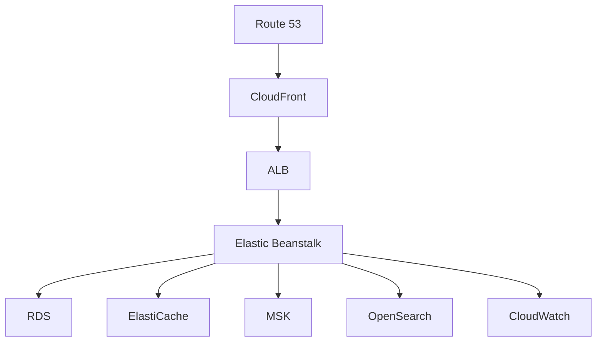

# AWS Deployment Strategy

## Infrastructure Components

### 1. Compute & Application Hosting

- **AWS Elastic Beanstalk**
  - Environment: Java 17
  - Platform: Amazon Linux 2
  - Instance Type: t3.micro (dev) / t3.small (prod)
  - Auto Scaling: Enabled
    - Min: 2 instances
    - Max: 5 instances
    - Scale based on CPU utilization (70%)

### 2. Database Layer

- **Amazon RDS**
  - Engine: MySQL 8.0
  - Instance: db.t3.micro (dev) / db.t3.small (prod)
  - Multi-AZ: Enabled for production
  - Backup: Automated daily backups
  - Retention: 7 days

### 3. Caching Layer

- **Amazon ElastiCache**
  - Engine: Redis
  - Node Type: cache.t3.micro
  - Cluster Mode: Disabled
  - Multi-AZ: Enabled for production

### 4. Message Broker

- **Amazon MSK (Managed Kafka)**
  - Version: 3.5.1
  - Broker Type: kafka.t3.small
  - Number of Brokers: 3 (production)
  - Storage: 100 GB per broker

### 5. Search Engine

- **Amazon OpenSearch Service**
  - Version: 2.5
  - Instance Type: t3.small.search
  - Nodes: 2 (production)
  - Storage: 100 GB

### 6. Load Balancer

- **Application Load Balancer**
  - Type: Application Load Balancer
  - Scheme: Internet-facing
  - SSL Certificate: AWS Certificate Manager
  - Health Check Path: /actuator/health

### 7. CDN & Static Content

- **Amazon CloudFront**
  - Origin: S3 bucket for static assets
  - SSL Certificate: AWS Certificate Manager
  - Caching Behavior: Optimized for static content

### 8. Monitoring & Logging

- **Amazon CloudWatch**
  - Metrics: CPU, Memory, Disk, Network
  - Logs: Application logs
  - Alarms:
    - High CPU utilization
    - Memory pressure
    - Error rate threshold
    - Latency threshold

## Deployment Architecture



## Deployment Process

### 1. Infrastructure Setup

1. **VPC Configuration**

   - Create VPC with public and private subnets
   - Configure security groups
   - Set up NAT Gateway

2. **Database Setup**

   - Create RDS instance
   - Configure security groups
   - Set up parameter groups
   - Initialize database schema

3. **ElastiCache Setup**

   - Create Redis cluster
   - Configure security groups
   - Set up parameter groups

4. **MSK Setup**

   - Create Kafka cluster
   - Configure security groups
   - Set up topics

5. **OpenSearch Setup**
   - Create domain
   - Configure security groups
   - Set up indices

### 2. Application Deployment

1. **Build Process**

   ```bash
   # Build JAR files
   ./mvnw clean package -DskipTests

   # Create deployment package
   zip -r deployment.zip target/*.jar .ebextensions/
   ```

2. **Elastic Beanstalk Configuration**

   ```yaml
   # .ebextensions/01_environment.config
   option_settings:
     aws:elasticbeanstalk:application:environment:
       SPRING_PROFILES_ACTIVE: prod
       SPRING_DATASOURCE_URL: jdbc:mysql://${RDS_HOSTNAME}:${RDS_PORT}/${RDS_DB_NAME}
       SPRING_REDIS_HOST: ${REDIS_HOST}
       SPRING_KAFKA_BOOTSTRAP_SERVERS: ${KAFKA_BOOTSTRAP_SERVERS}
       SPRING_ELASTICSEARCH_URIS: ${OPENSEARCH_ENDPOINT}
   ```

3. **Deployment Steps**
   ```bash
   # Deploy to Elastic Beanstalk
   eb deploy
   ```

### 3. Monitoring Setup

1. **CloudWatch Configuration**

   - Set up log groups
   - Configure metrics
   - Create alarms

2. **Health Checks**
   - Configure ALB health checks
   - Set up application health endpoints

## Security Considerations

### 1. Network Security

- VPC with private subnets for databases
- Security groups for each service
- Network ACLs for subnet protection

### 2. Data Security

- RDS encryption at rest
- ElastiCache encryption
- MSK encryption
- OpenSearch encryption

### 3. Application Security

- SSL/TLS for all endpoints
- IAM roles for service access
- Secrets Manager for credentials

## Cost Optimization

### 1. Development Environment

- Use smaller instance types
- Disable Multi-AZ
- Reduce backup retention

### 2. Production Environment

- Use reserved instances for RDS
- Enable auto-scaling
- Use spot instances for non-critical workloads

## Backup & Disaster Recovery

### 1. Database Backups

- Automated daily backups
- Point-in-time recovery
- Cross-region backup replication

### 2. Application Backups

- Elastic Beanstalk environment snapshots
- Configuration backups
- Application state backups

## Maintenance & Updates

### 1. Database Updates

- Use blue-green deployment
- Test in staging first
- Monitor performance metrics

### 2. Application Updates

- Use Elastic Beanstalk rolling updates
- Deploy during low-traffic periods
- Monitor application metrics

## References

- [AWS Elastic Beanstalk Documentation](https://docs.aws.amazon.com/elasticbeanstalk/)
- [Amazon RDS Documentation](https://docs.aws.amazon.com/rds/)
- [Amazon ElastiCache Documentation](https://docs.aws.amazon.com/elasticache/)
- [Amazon MSK Documentation](https://docs.aws.amazon.com/msk/)
- [Amazon OpenSearch Documentation](https://docs.aws.amazon.com/opensearch-service/)
